<p align="center">
  
</p>

<p align="center">
  <a href="https://github.com/ishandutta2007/Awesome-Awesome-Awesome"></a>
  <a href="https://discord.gg/jc4xtF58Ve"></a>
  <a href="https://www.python.org/"></a>
  <a href="https://opensource.org/licenses/MIT"></a>
  <a href="https://github.com/ishandutta2007/icloud-downloader/stargazers"></a>
  <a href="https://github.com/ishandutta2007/icloud-downloader/issues"></a>
  <a href="https://github.com/ishandutta2007"></a>
</p>

---

# 🚀 iCloud Photo & Video Downloader: Open-Source Python CLI Backup Tool 📸

A simple, lightning-fast, and secure Python command-line utility to **download, export, and back up your iCloud Photos and Photo Albums** 🖼️ locally to your Mac 🍎, Windows 🪟, or Linux 🐧 machine.


---

## 📌 Overview 🔍

Are you looking for an easy way to **export your Apple iCloud Photos library** 📚, create offline local backups 💾, or download specific iCloud photo albums automatically? 

**iCloud Photo & Video Downloader** (`icloud-downloader`) 📥 is an open-source Python CLI tool powered by [`pyicloud`](https://github.com/picklepete/pyicloud). It lets you automate the download of full-resolution images 📷 and videos 🎥 directly from Apple iCloud servers ☁️ to your local hard drive, NAS 🗄️, or external storage 🔌.

---

## 📑 Table of Contents 🧭

- [✨ Features](#-features-)
- [🎯 Why Use This Tool?](#-why-use-this-tool-)
- [📋 Prerequisites](#-prerequisites-)
- [📦 Installation](#-installation-)
- [💡 Quick Start & Usage](#-quick-start--usage-)
  - [🔑 1. Authentication & Credentials](#-1-authentication--credentials)
  - [▶️ 2. Download Commands](#-2-download-commands)
- [⚙️ Command Line Options](#-command-line-options-)
- [❓ Frequently Asked Questions (FAQ)](#-frequently-asked-questions-faq-)
- [🔧 Troubleshooting](#-troubleshooting-)
- [✨ Star History](#-star-history)
- [💬 Community & Support](#-community--support-)
- [💖 Support & Sponsorship](#-support--sponsorship-)
- [⚠️ Disclaimer & Security](#-disclaimer--security-)

---

## ✨ Features 🌟

- **⚡ Fast & Automated Batch Downloads**: Export your entire "All Photos" collection or individual albums with a single command 🚀.
- **🗂️ Complete Folder & Album Structure**: Download all albums at once with the `--all-albums` flag to preserve your categorized iCloud album folder hierarchy 📁.
- **🔒 Secure Credential Handling**: Reads Apple ID credentials securely from a local `.env` file or prompts securely at runtime without exposing secrets in your terminal history 🛡️.
- **📱 Two-Factor Authentication (2FA / 2SA)**: Native interactive support for Apple ID Two-Factor Authentication security codes 📲.
- **📊 Real-Time Visual Progress**: Integrated `tqdm` progress bars display download status, file count, and completion rates 📈.
- **🛡️ Error Resilient**: Automatically skips corrupted or inaccessible files and proceeds with the rest of your library without crashing 🔄.
- **💻 Cross-Platform**: Works seamlessly across macOS 🍏, Linux 🐧, and Windows 🪟 systems.

---

## 🎯 Why Use This Tool? 💡

| Feature ⚙️ | iCloud Web Interface 🌐 | Apple Photos App 📱 | `icloud-downloader` 🚀 |
| :--- | :--- | :--- | :--- |
| **Batch Bulk Export** 📦 | ⚠️ Limited to 1,000 files | ⚠️ Manual drag-and-drop | ✅ **Unlimited automation** |
| **Preserve Album Folders** 🗂️ | ❌ Manual sorting | ⚠️ Manual export | ✅ **Automatic folder hierarchy** |
| **Headless / CLI / NAS Support** 🖥️ | ❌ No | ❌ macOS only | ✅ **Linux, Windows, macOS, Servers** |
| **Scheduled Backups (Cron)** ⏰ | ❌ No | ❌ No | ✅ **CLI scriptable** |
| **100% Free & Open Source** 💸 | Free (Apple limits) | Free with macOS | ✅ **Free & Open Source (MIT)** |

---

## 📋 Prerequisites 🛠️

- **🐍 Python**: Python `3.8` or newer installed on your system.
- **🆔 Apple ID**: An active Apple ID with iCloud Photos enabled.
- **🌐 Network**: Internet connection to communicate with iCloud services.

---

## 📦 Installation 💻

### 1. 📥 Clone the repository:
```bash
git clone https://github.com/ishandutta2007/icloud-downloader.git
cd icloud-downloader
```

### 2. 🌳 Set up a Python Virtual Environment:
It is highly recommended to use a virtual environment to manage dependencies:

```bash
# Create a virtual environment
python -m venv venv

# Activate the virtual environment
# On macOS / Linux:
source venv/bin/activate

# On Windows (Command Prompt / PowerShell):
venv\Scripts\activate
```

### 3. 📦 Install required packages:
```bash
pip install -r requirements.txt
```

---

## 💡 Quick Start & Usage 🚀

### 🔑 1. Authentication & Credentials

For automated and seamless backups, configure your Apple ID credentials using an environment file:

1. Create a `.env` file in the project root:
   ```bash
   touch .env
   ```
2. Add your Apple ID details:
   ```env
   APPLE_ID=your_apple_id@example.com
   APPLE_PASSWORD=your_super_secret_password
   ```

> [!NOTE]
> 🔒 The `.gitignore` file is pre-configured to ignore `.env` files. If you do not configure a `.env` file, the script will securely prompt you for your Apple ID and password during execution.

### ▶️ 2. Download Commands

Run the downloader from your terminal:

#### 🔹 Download the default "All Photos" album:
Downloads all photos into the default `iCloud_Photos/` directory 📁:
```bash
python icloud_downloader.py
```

#### 🔹 Download a specific photo album:
```bash
python icloud_downloader.py --album "Summer Vacation"
```

#### 🔹 Save photos to a custom backup directory (e.g. External Drive or NAS):
```bash
python icloud_downloader.py --directory "./My_iCloud_Backup"
```

#### 🔹 Download ALL albums into organized sub-folders:
Creates a root directory and organizes each album into its own separate folder replicating your iCloud library structure 🗂️:
```bash
python icloud_downloader.py --all-albums
```

---

## ⚙️ Command Line Options 🎛️

| Option 🏷️ | Argument 📥 | Description 📝 | Default 🔘 |
| :--- | :--- | :--- | :--- |
| `--directory` | `<path>` | Path to the local directory where photos and videos will be saved. | `iCloud_Photos` |
| `--album` | `<"Album Name">` | Name of the specific iCloud album to download. | `"All Photos"` |
| `--all-albums` | _flag_ | Downloads all albums into organized sub-directories (overrides `--album`). | `False` |

---

## ❓ Frequently Asked Questions (FAQ) 💬

<details>
<summary><b>📷 Does this tool download full-resolution photos and videos?</b></summary>
Yes! The downloader requests and saves original full-resolution media directly from your iCloud Photos stream.
</details>

<details>
<summary><b>📱 How does Two-Factor Authentication (2FA) work?</b></summary>
When 2FA is triggered, Apple sends a verification code to your trusted Apple devices. The script prompts you to enter this 6-digit code directly in the terminal to validate your session.
</details>

<details>
<summary><b>🖥️ Can I run this script on a headless Linux server or NAS?</b></summary>
Yes. Because it is a pure Python command-line utility, it can run on headless Linux servers, Raspberry Pi, Docker, or NAS appliances.
</details>

<details>
<summary><b>🛡️ Will this delete or modify any photos on my iCloud account?</b></summary>
No. The tool uses read-only operations to fetch and download assets. It will never delete, move, or modify any media on your iCloud account.
</details>

---

## 🔧 Troubleshooting 🛠️

- ❌ **Invalid Apple ID or Password**: Verify your login credentials in `.env` or check if your account requires an app-specific password / web login verification.
- 🔍 **Album Not Found**: Check the exact spelling and casing of your album name. If the album name contains spaces, wrap it in quotes (e.g. `--album "Family Trip 2024"`).
- ⏳ **Session Expiration / 2FA Prompt**: Apple iCloud sessions expire periodically. If prompted, re-enter your 2FA code in the terminal.

---

##  Star History
[](https://star-history.dera.page/#ishandutta2007/icloud-downloader&type=date&legend=top-left)

---

## 💬 Community & Support 🤝

- 📚 **[Documentation](https://docs.open-workflows.com):** Detailed guides and tutorials.
- 🗣️ **[Forum](https://community.open-workflows.com):** Ask questions, share workflows, and get help.
- 💬 **[Discord Community](https://discord.gg/jc4xtF58Ve):** Real-time chat with the community.
- 🐦 **[Twitter (@ishandutta2007)](https://twitter.com/ishandutta2007):** Updates and news.
- 🐙 **[GitHub (@ishandutta2007)](https://github.com/ishandutta2007):** Follow for updates and projects.

---

## 💖 Support & Sponsorship ☕

If this tool saved you time or helped you secure your photo backups, please consider supporting its ongoing open-source maintenance:

👉 **[Sponsor @ishandutta2007 on GitHub](https://github.com/sponsors/ishandutta2007)**

---

## ⚠️ Disclaimer & Security 🔒

This project is an independent, open-source third-party tool and is **not affiliated with, endorsed by, or sponsored by Apple Inc.** Always keep your `.env` file secure and ensure it is never committed to public version control repositories. Use this software at your own risk.